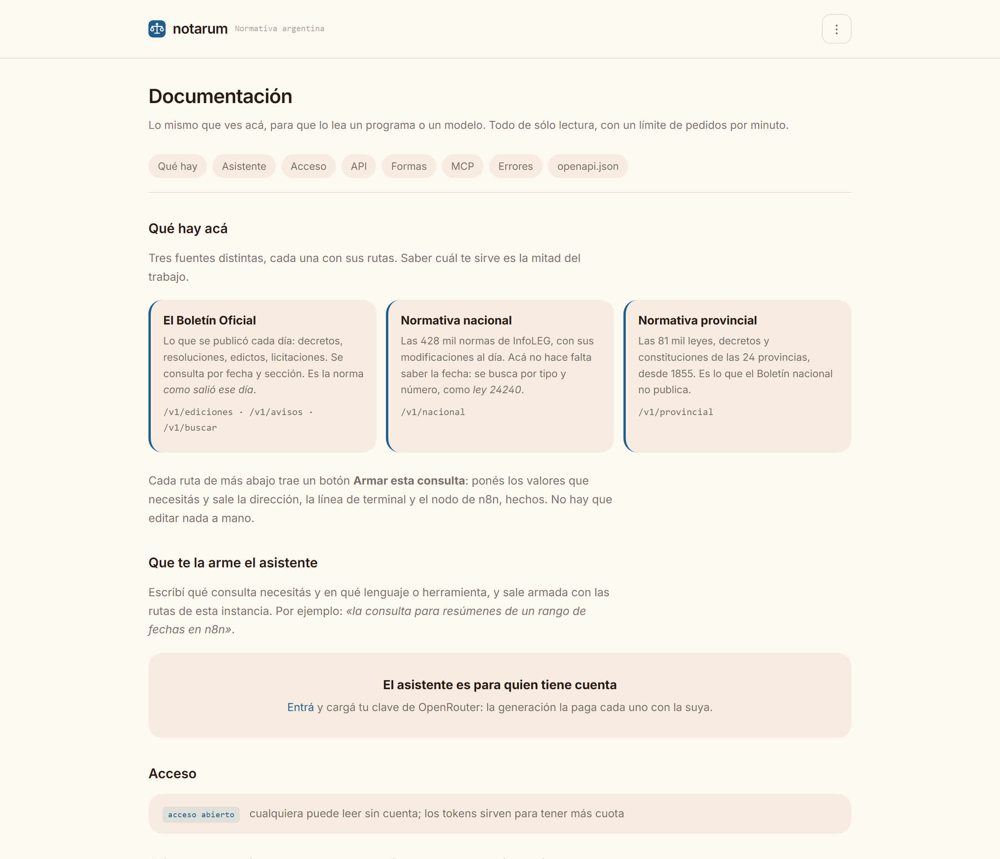

<h1 align="center">notarum</h1>

<p align="center">
  <strong>La normativa argentina, legible.</strong><br>
  Un lector, una API y herramientas para modelos — en un solo binario.
</p>

<p align="center">
  <a href="https://github.com/diegoparras/notarum/actions/workflows/ci.yml"></a>
  <a href="LICENSE"></a>
  
  
</p>

---

Lo que el Estado argentino decide está publicado y es público, pero repartido
en tres lados que no se hablan entre sí:

- **El Boletín Oficial**, todos los días hábiles: decretos, resoluciones,
  licitaciones, sociedades, sucesiones. La norma *como salió ese día*.
- **InfoLEG**, con 428 mil normas nacionales y sus modificaciones al día. La
  norma *como está hoy*, y qué la modificó.
- **La Base SAIJ**, con 81 mil leyes, decretos y constituciones de las 24
  provincias desde 1855: lo que el Boletín nacional no publica.

Los tres están en la web, y los tres están hechos para leerlos de a uno por
vez. El del Boletín pagina de a cien y no dice cuántos resultados hay.

**notarum los convierte en algo que se puede leer, consultar por programa y
preguntarle a un modelo.** No opina, no clasifica, no puntúa: entrega el dato
crudo y bien tipado, y eso es todo su valor.

```bash
docker run -d -p 8080:8080 -v notarum-datos:/datos \
  -e NOTARUM_ALMACEN=sqlite ghcr.io/diegoparras/notarum:latest
```

Abrí `http://localhost:8080` y ya estás leyendo el Boletín de hoy. La
normativa nacional y la provincial se bajan una vez, desde el panel.

---

## El lector


La edición del día, con sus rubros y sus cuentas. Navegación a la fecha
anterior y la siguiente **saltando los feriados**, porque no todos los días hay
edición. Cada aviso muestra su organismo, su norma y su síntesis, y marca si
trae anexos, si salió en el suplemento o si ya se había publicado antes.

### Un aviso


El texto completo, saneado —sin los estilos ni los scripts que trae el
original— y con las tablas conservadas, que en un decreto de designaciones o de
aranceles son el contenido. Los anexos se bajan desde acá: el sitio oficial los
entrega por una llamada de JavaScript que devuelve el PDF en base64, y notarum
los sirve como archivos.

### El calendario


Qué días hubo edición, de un vistazo. La línea naranja marca los que tuvieron
suplemento. Sirve para saber dónde mirar antes de recorrer un rango de fechas.

### La documentación



En `/docs`, la API y el MCP documentados **dentro del propio servicio**, con la
dirección de tu instancia en cada ejemplo para que se puedan copiar y pegar.

No es un texto escrito aparte: se dibuja del mismo `openapi.json` que sirve la
API y de la misma lista de herramientas que recibe el modelo. Si mañana se
agrega una ruta o una herramienta, aparece sola — y hay tests que fallan si
alguna queda sin documentar.

Arriba de todo dice **qué hay en cada fuente**, que es lo que hace falta para
saber a cuál preguntarle. Y cada ruta trae un formulario: se ponen los valores
y salen la dirección, la línea de `curl` y el nodo de n8n, hechos.

### La búsqueda


Fijate en el detalle: **"7 resultados del índice local, sin consultar el
Boletín (2 de 7 días del rango están guardados)"**. La búsqueda dice de dónde
salieron los resultados y cuánta historia tenía para mirar. Nunca vas a creer
que viste todo cuando viste una parte.

Y encuentra `SECRETARÍA DE ENERGÍA` buscando `energia`, sin tilde, porque nadie
escribe los acentos en una caja de búsqueda.

<details>
<summary>En pantalla chica</summary>


</details>

---

## Las tres caras

### 1. El lector, en `/`

Server-rendered con `html/template`, embebido en el binario. **Cero JavaScript,
cero recursos de terceros**: el contenedor no depende de ninguna red más que la
del propio Boletín. Sigue el sistema visual del Ecosistema Escriba.

### 2. La API, en `/v1`

```bash
curl https://tu-instancia/v1/ediciones/primera/2026-09-01
```

```json
{
  "seccion": "primera",
  "fecha": "2026-09-01",
  "cantidad": 100,
  "por_rubro": { "DECRETOS": 12, "RESOLUCIONES": 80, "…": 8 },
  "avisos": [
    {
      "id": "346633",
      "rubro": "DECRETOS",
      "organismo": "PODER EJECUTIVO",
      "norma": "Decreto 845/2026",
      "referencia": "DECTO-2026-845-APN-PTE",
      "sintesis": "Disposiciones.",
      "tiene_anexos": true,
      "repetido": false,
      "url": "https://www.boletinoficial.gob.ar/detalleAviso/primera/346633/20260901"
    }
  ]
}
```

| Ruta | Devuelve |
|---|---|
| `GET /v1/secciones` | las secciones que sabe leer |
| `GET /v1/calendario/{año}/{sección}` | los días con edición y los que tuvieron suplemento |
| `GET /v1/ediciones/{sección}/{fecha}` | la edición completa; acepta `?rubro=` |
| `GET /v1/ediciones/{sección}?desde=&hasta=` | resúmenes de un rango, sin avisos |
| `GET /v1/avisos/{sección}/{id}/{fecha}` | el aviso con `texto`, `html` y `anexos` |
| `GET /v1/anexos/{sección}/{nro}/{id}/{fecha}.pdf` | el PDF del anexo |
| `GET /v1/rubros/{sección}` | el catálogo de rubros |
| `GET /v1/buscar?…&fuente=indice\|sitio\|auto` | búsqueda por texto y fecha |
| `GET /v1/provincial?texto=&provincia=&tipo=&desde=&hasta=&vigentes=` | normativa de las 24 provincias |
| `GET /v1/provincial/provincias` | las jurisdicciones y cuántas normas hay de cada una |
| `GET /v1/provincial/tipos` | los tipos de norma provincial |
| `GET /v1/provincial/{id}` | una norma provincial, con su ficha en SAIJ |
| `GET /v1/nacional?texto=&tipo=&desde=&hasta=&con_texto=` | las 428 mil normas nacionales de InfoLEG |
| `GET /v1/nacional/tipos` | los tipos de norma nacional |
| `GET /v1/nacional/{id}` | una norma nacional, con su ficha y su texto |
| `GET /v1/nacional/{id}/modificada-por` | qué normas modificaron a ésta |
| `GET /v1/nacional/{id}/modifica-a` | a qué normas modificó ésta |
| `GET /v1/nacional/novedades?desde=` | qué apareció en el catálogo desde una fecha |
| `GET /v1/provincial/novedades?desde=` | lo mismo, para la provincial |
| `GET /v1/todo?texto=` | la misma búsqueda en las tres fuentes, marcada por origen |
| `GET /v1/salud` | estado del servicio, del sitio y de la caché |
| `GET /v1/openapi.json` | el contrato, validado por un test |

Sin clave para leer. Límite por IP. `ETag` y `Cache-Control` en todo: una
edición pasada se declara inmutable por un año, porque **una edición pasada no
cambia nunca**.

Cada error dice de quién es la culpa, para que sepas a quién mirar:

```json
{ "error": "el Boletín Oficial no devolvió lo esperado", "origen": "sitio" }
```

`origen` es `sitio`, `notarum` o `pedido`.

### 3. El MCP, en `/mcp` y por entrada estándar

Para que un modelo consulte las tres fuentes como una herramienta más:
`edicion`, `aviso`, `buscar`, `calendario`, `rubros` y `estado` para el
Boletín; `nacional_buscar`, `nacional_norma`, `nacional_relaciones` y
`nacional_tipos` para la normativa nacional; `provincial_buscar`,
`provincial_norma` y `provincial_tipos` para las provincias; y dos que cruzan
todo: `buscar_todo`, que pregunta en las tres a la vez, y `novedades`, que
contesta qué apareció desde una fecha.

```json
{
  "mcpServers": {
    "notarum": {
      "command": "notarum",
      "args": ["mcp", "--almacen", "sqlite", "--db", "/ruta/notarum.db"]
    }
  }
}
```

Están pensadas para un modelo y no para una persona, y se nota en las
decisiones: una edición se recorta a 40 avisos **y lo dice**, en vez de llenar
la ventana de contexto en silencio; un feriado se explica en palabras en vez de
devolver un error; y el aviso entrega el texto plano sin el HTML, que sólo
gasta tokens. Y cada una explica qué falta en vez de devolver una lista vacía:
un modelo que recibe una lista vacía concluye que no hay nada y sigue de largo.

---

## Lo que el sitio no cuenta

El Boletín Oficial no tiene API pública ni documentación. Todo lo que hay acá
salió de leer el sitio con `curl` y mirar su JavaScript. Estas son las cosas
que costaron, por si a alguien le sirven:

- **El catálogo de rubros** está en `/busquedaAvanzada/{sección}/rubros`, que
  devuelve JSON. No está enlazado en ningún lado: lo carga por AJAX el selector
  de la búsqueda avanzada. Y los ids son textuales, no numéricos.

- **`?anexos=1` no hace nada.** Devuelve exactamente la misma página; sólo
  prende un flag de JavaScript que hace scroll. Los anexos ya están en el HTML
  del detalle, en un `onclick` que llama a `descargarPDFAnexo(...)`, y el PDF se
  baja con un POST a `/pdf/download_anexo` que responde en base64.

- **Todos los anexos de un aviso comparten el mismo `idAnexo`** y se distinguen
  por `nroAnexo`. Deduplicar por id deja uno de doce. Este lo encontró un test
  contra el sitio real, no los fixtures.

- **`?suplemento=1` tampoco hace nada:** la portada normal ya incluye el
  suplemento, y sus avisos se reconocen por el rubro `(SUPLEMENTO)`.

- **La segunda y la tercera sección sí usan `/detalleAviso/...`**, pero su id
  puede ser alfanumérico (`A1522579`) y sus avisos traen sólo el organismo.

- **El calendario viene como un string JSON adentro de otro JSON**: hay que
  decodificar dos veces.

- **La búsqueda avanzada** acepta un POST con las fechas en `dd/mm/aaaa`. Con
  `AAAAMMDD` o con ISO responde "fecha inválida".

- **El organismo puede venir vacío** y es un dato legítimo, no una falla: en el
  rubro `LEYES`, los decretos de promulgación no lo traen.

- **Un rubro terminado en `- ANTERIOR`** agrupa avisos ya publicados en una
  edición previa. notarum los entrega con `"repetido": true` para que quien
  consuma decida si los cuenta.

Todo eso está verificado contra el sitio y clavado en tests con cantidades
conocidas: 73 avisos el 15/7/2026, 52 el 10/3/2025, 100 el 1/9/2026.

---

## Montarlo

### Docker, en una línea

```bash
docker run -d --name notarum -p 8080:8080 \
  -v notarum-datos:/datos \
  -e NOTARUM_ALMACEN=sqlite \
  -e "NOTARUM_USER_AGENT=notarum/1.7 (+https://tu-dominio.com)" \
  ghcr.io/diegoparras/notarum:latest
```

El volumen en `/datos` no es opcional en la práctica: sin él, cada redeploy
vuelve a bajar todo el Boletín desde cero.

### EasyPanel

**+ Service → App**, y después:

| Campo | Valor |
|---|---|
| Source → Type | `Image` |
| Image | `ghcr.io/diegoparras/notarum:latest` |
| Volume | `notarum-datos` montado en `/datos` |
| Domain → Port | `8080`, con HTTPS |

Environment:

```
NOTARUM_ALMACEN=sqlite
NOTARUM_DB=/datos/notarum.db
NOTARUM_POR_MINUTO=60
NOTARUM_INTERVALO=500ms
NOTARUM_LOG=json
NOTARUM_USER_AGENT=notarum/1.7 (+https://tu-dominio.com)
```

Deploy, y entrá a la raíz. La guía completa, con las dos formas de resolver el
registry y el detalle de cada paso, está en
[docs/easypanel.md](docs/easypanel.md).

### Cambiar de motor sin volver a bajar todo

Pasar de SQLite a Postgres no cuesta volver a bajar los catálogos:

```bash
notarum migrar --origen sqlite --db /datos/notarum.db
```

Se corre con la configuración del motor nuevo puesta y el viejo como origen. Lo
vencido no se arrastra, y el índice de búsqueda se rearma desde las ediciones
copiadas en vez de traducirse: traducir un índice entre dos motores es la clase
de cosa que sale mal en silencio.

Las escrituras masivas van por lotes. Sincronizar InfoLEG son 428 mil
escrituras y las relaciones suman unas 200 mil más: de a una, con SQLite es una
transacción y su espera al disco por norma, y con Postgres un viaje por la red
cada vez. Medido contra el catálogo real, con lotes son unos seis minutos.

### Configuración

| Variable | Por defecto | Qué hace |
|---|---|---|
| `NOTARUM_PUERTO` | `8080` | puerto HTTP |
| `NOTARUM_ALMACEN` | `disco` | `disco`, `sqlite` o `postgres` |
| `NOTARUM_CACHE` | `/datos/cache` | directorio, con el motor `disco` |
| `NOTARUM_DB` | `/datos/notarum.db` | archivo, con el motor `sqlite` |
| `NOTARUM_POSTGRES_DSN` | — | cadena completa, con el motor `postgres` |
| `NOTARUM_POSTGRES_HOST` … | — | o las piezas sueltas: `_PUERTO`, `_BASE`, `_USUARIO`, `_CLAVE`, `_SSL`, `_ESQUEMA` |
| `NOTARUM_POR_MINUTO` | `60` | pedidos por minuto por IP; `0` lo desactiva |
| `NOTARUM_INTERVALO` | `500ms` | espera entre pedidos al Boletín |
| `NOTARUM_USER_AGENT` | `notarum/1.7 (+…)` | poné una URL de contacto real |
| `NOTARUM_LOG` | `json` | `json` o `text` |
| `NOTARUM_MCP_TOKEN` | vacío | si se define, `/mcp` exige `Bearer` |
| `NOTARUM_SIN_MCP` | vacío | apaga `/mcp` |
| `NOTARUM_SIN_WEB` | vacío | apaga el lector y deja sólo la API |
| `NOTARUM_BUSCADOR_INFOLEG` | vacío | enciende la búsqueda nacional; cuesta unos 480 MB |
| `NOTARUM_ACTUALIZAR_A_LAS` | `05:00` | cuándo se actualizan los catálogos |
| `NOTARUM_BOLETIN_A_LAS` | `04:00` | cuándo baja la semana del Boletín, los sábados |
| `NOTARUM_ZONA` | `America/Argentina/Buenos_Aires` | dónde se cuentan esas horas |
| `NOTARUM_SIN_ACTUALIZACION_AUTOMATICA` | vacío | apaga las actualizaciones solas |
| `NOTARUM_MEMORIA_MAX` | lo del contenedor | un techo como `1GB` |
| `NOTARUM_WEBHOOK_PERMITE_PRIVADAS` | vacío | deja que las alertas avisen a direcciones internas |

Las variables de sí o no entienden `1/0`, `si/no`, `true/false` y `on/off`.
Cualquier valor no vacío contando como sí hacía que `NOTARUM_SIN_MCP=0` apagara
el MCP: lo contrario exacto de lo que quiso escribir quien lo escribió.

### Quién entra, y cuánto puede pedir

Esto lo decide quien monta la instancia, no notarum. Una cátedra puede querer
su copia abierta a cualquiera; un estudio, la suya cerrada; un organismo, el
lector público con la API por token. Las tres son legítimas.

| Variable | Por defecto | Qué hace |
|---|---|---|
| `NOTARUM_ACCESO` | `cerrado` si hay cuentas | `abierto`, `mixto` o `cerrado` |
| `NOTARUM_CUOTA_PERSONA` | `600` | pedidos por minuto de quien se identifica |
| `NOTARUM_CUOTA_ADMIN` | `6000` | los de quien administra |
| `NOTARUM_CUOTA_LECTOR` | `600` | los de las páginas web, que van aparte |
| `NOTARUM_CUOTA_LOGIN` | `10` | intentos de entrada por minuto |
| `NOTARUM_SECRETO_SESION` | se genera | firma las sesiones; fijalo para que sobrevivan al reinicio |
| `NOTARUM_ADMIN_USUARIO` | `admin` | la cuenta que administra |
| `NOTARUM_ADMIN_CLAVE` | se genera | su clave; sin esto se genera una y se imprime en el log una vez |
| `NOTARUM_BUSCADOR_INFOLEG` | vacío | con `1`, enciende la búsqueda de normativa nacional; pide 1 GB de memoria |

- **abierto**: leer no pide nada. Las cuentas sirven para tener más cuota y
  para el MCP.
- **mixto**: el lector web es público, la API y el MCP piden token.
- **cerrado**: nada sin sesión o token.

Mientras no exista ninguna cuenta, notarum funciona abierto y sin login, que
es como viene. Las cuentas se encienden con la primera:

```bash
notarum usuarios crear diego --rol admin
```

La clave se pide por teclado y no queda en el historial del shell. Desde
`/cuenta` se crean y se revocan los tokens de API y de MCP; del token sólo se
guarda su huella, así que se muestra una vez y ni notarum puede recuperarlo.

Cada zona tiene su propia cuota —lector, API, MCP, login—, así que bajar el
límite de la API no deja la interfaz inusable.

### El panel

Todo lo que pone en marcha y configura una instancia se hace desde `/admin`,
sin abrir una consola: llenar la historia del Boletín, sincronizar InfoLEG,
bajar la normativa provincial, y decidir quién entra y cuánto puede pedir.

Lo que se configura ahí se guarda y pisa a las variables de entorno, así que
abrir o cerrar la instancia no obliga a volver a desplegar. Siempre se puede
volver a lo que diga la configuración del servicio.

**La cuenta que administra sale de la configuración**, como en el resto de la
suite: `NOTARUM_ADMIN_USUARIO` y `NOTARUM_ADMIN_CLAVE`. Si no se define la
clave, se genera una y se imprime en el log al arrancar —una sola vez—. Y si
alguna vez te quedás afuera, ponés otra en el entorno y reiniciás: se aplica
sola.

El panel dice además **cuántas ediciones hay de cada sección**, con la primera
y la última guardadas. La cuenta total de entradas no distinguía: una instancia
con diez años de la primera y nada de la tercera se veía igual que una
completa.

Los trabajos son de minutos —o de horas, con el texto de cada aviso— así que
corren en segundo plano y la pantalla muestra cómo van; se puede cerrar la
página y volver después.

**Cada cosa se actualiza sola a su horario.** Los catálogos son minutos y van
todos los días a las cinco. Bajar el texto de una semana entera del Boletín son
horas, así que va los sábados a las cuatro, con la máquina tranquila: las tres
secciones, de lunes a viernes de la última semana completa. Un feriado sin
edición se cuenta aparte de los días que fallaron de verdad, y una sección que
falla no se lleva a las otras dos.

Es de quien administra: hace falta una cuenta con rol `admin`. Los mismos
trabajos siguen estando por consola (`notarum rellenar`, `notarum infoleg`,
`notarum provincial`) para quien prefiera automatizarlos.

### Buscar normativa, no ediciones

`/v1/buscar` recorre los avisos del Boletín día por día: sirve para saber qué
se publicó en un período. Pero para encontrar una norma sin saber en qué día
salió hacen falta los catálogos.

- **`/v1/nacional`** busca en las 428 mil normas de InfoLEG. Pedir «ley 24240»
  trae esa ley primero, no las que la modifican. Se enciende con
  `NOTARUM_BUSCADOR_INFOLEG=1`: son unos 350 MB en memoria, medidos con el
  catálogo real, así que no vienen puestos.
- **`/v1/provincial`** busca en las 81 mil provinciales, y no cuesta pedirlo.

Los dos aceptan los números con puntos o sin ellos: `24.240` y `24240` dan lo
mismo.

### El asistente de consultas

La documentación dice qué rutas hay, pero traducir eso al cliente HTTP de n8n
o a un script es un trabajo aparte. En `/docs` hay una caja donde se escribe
lo que se quiere:

> la consulta para resúmenes de un rango de fechas en n8n

…y sale armada, con las rutas de esa instancia y el contrato delante. El
contexto se arma del mismo `openapi.json` y de la misma lista de herramientas
MCP de las que se dibuja la documentación, así que no se puede desactualizar.

**La clave del proveedor la pone cada persona** desde su cuenta y paga lo
suyo: notarum no tiene una propia. Es de OpenRouter, se prueba antes de
guardarla, se guarda cifrada con AES-GCM y nunca se muestra de vuelta —sólo
los primeros y los últimos caracteres, para reconocer cuál está cargada—. Se
puede sacar cuando se quiera.

**El modelo se elige entre los que ofrece esa clave**, con lo que cobra cada
uno por millón de tokens al lado. La lista se le pide a OpenRouter y no está
escrita acá: un nombre de modelo en una constante envejece solo, y ya pasó —el
que estaba puesto no existía en el catálogo, así que ninguna generación
funcionaba—. Hay un test que lo comprueba contra el catálogo real todos los
días.

También se manda sólo lo que cada modelo acepta: 82 de los 426 del catálogo
rechazan `temperature`, toda la familia GPT-5 entre ellos, y mandárselo igual
rompía la generación antes de empezar.

La generación **no espera al proveedor**: contesta en el acto y sigue por su
cuenta. Un pedido HTTP colgado de un tercero termina en la página de error del
proxy, que no explica nada; así, un error que notarum puede explicar lo muestra
notarum.

El modelo no ejecuta nada: escribe algo para copiar y pegar, y se ve antes de
correrlo.

### La normativa de las provincias

El Boletín Oficial de la Nación no publica las leyes provinciales: cada
provincia tiene su propio boletín. Esa parte la cubre la **Base SAIJ de
Normativa Provincial** del Ministerio de Justicia — 81.403 leyes, decretos
leyes, códigos y las 41 constituciones de las 24 jurisdicciones, desde 1855.

```bash
notarum provincial
```

…o el botón en `/admin`, que hace lo mismo. Baja el catálogo y lo guarda. Tarda unos segundos y se puede volver a correr:
si el portal no publicó nada nuevo, no baja nada. Después queda en
`/provincial` en el lector, en `/v1/provincial` en la API y como
`provincial_buscar` en el MCP.

De cada norma están la provincia, el tipo, el número, las fechas de sanción y
publicación, el estado de vigencia, el título, las materias y el enlace a su
ficha en SAIJ. **El texto completo no**: se midió sobre una muestra al azar y
SAIJ lo publica para el 7% de las normas, así que notarum enlaza a la fuente
en vez de prometer una copia que casi siempre estaría vacía.

El catálogo se sirve desde memoria: 77 MB y 340 ms de carga, medidos con la
base entera. Los paga sólo quien lo sincroniza — una instancia que no use la
parte provincial no carga nada. Se apaga del todo con `NOTARUM_SIN_SAIJ`.

### Qué modificó a qué

El catálogo dice «modificada por 7» y no dice cuáles. Es un dato que no lleva a
ningún lado: saber que una ley cambió sin saber qué la cambió obliga a ir a
buscarlo a otro lado igual.

El detalle está en dos bases complementarias del mismo dataset, y se bajan con
la misma sincronización.

```bash
curl https://tu-instancia/v1/nacional/24240/modificada-por
```

Cuál de las dos normas describen las columnas de esas bases no está
documentado, y los nombres de los archivos engañan. Se midió: en la base de
«normas modificadas», 82 de 90 identificadores repetidos traen datos distintos,
así que las columnas describen a la modificatoria; en la de «modificatorias»,
192 de 192. Cada archivo da la otra punta de la relación.

El reparto es extremo: el promedio son 3,7 modificatorias por norma, pero la
ley 14250 —convenios colectivos— tiene **42.427**, porque cada convenio
homologado figura como una. Las listas se acotan a las 200 más nuevas y siempre
se muestra el total de verdad.

### Alertas, y feeds

Una búsqueda guardada que corre después de cada actualización y avisa **sólo lo
nuevo**. Se crea desde `/cuenta`: dónde mirar, qué esperar, y a dónde avisar
—un webhook de n8n, un feed Atom, o nada y se ve en la cuenta—.

Dos decisiones definen si sirve o no:

- **Sólo lo nuevo.** Una alerta que repite todos los días lo mismo se ignora a
  la semana. Cada una recuerda qué ya avisó, y lo que deja de coincidir se
  olvida: si vuelve a aparecer, volver a avisarlo es lo correcto.
- **La primera pasada no avisa nada.** Estrenar una alerta sobre un tema viejo
  mandaría de golpe todo lo que existe desde 1993, que es la forma más rápida
  de que alguien la borre. Al crearla se prueba en el acto y dice con cuánto
  coincide hoy.

La dirección del webhook la pone quien crea la alerta y notarum es el que sale
a buscarla, lo que lo convierte en un mensajero de pedidos ajenos. Se rechazan
las direcciones internas —loopback, redes privadas, link-local y el rango de
metadatos de las nubes—, se resuelve el nombre antes de decidir, y no se siguen
redirecciones.

El feed lleva su clave en la dirección, porque un lector de feeds no manda
cabeceras. Es una concesión, así que no es el token de la cuenta: abre esa
alerta y nada más, y se da de baja sola.

### Qué apareció desde una fecha

Un programa que consulta todos los días no quiere el catálogo entero: quiere lo
que cambió.

```bash
curl 'https://tu-instancia/v1/nacional/novedades?desde=2026-09-01'
```

«Nuevo» quiere decir **que notarum no lo había visto**, no que la norma sea
reciente. Los portales agregan normas viejas todo el tiempo, y una ley de 1998
que aparece hoy es una novedad para quien sigue el catálogo; filtrar por la
fecha de la norma se las perdería sin avisar.

La respuesta dice además si el registro alcanza para contestar lo que se
preguntó. Se guardan 120 días: preguntar por antes de eso no se puede
responder, y contestar «no pasó nada» sería un agujero que no se nota nunca.

### La consulta, armada

Cada ruta de `/docs` trae un formulario con sus campos de verdad. Se ponen los
valores y salen las tres formas hechas: la dirección, la línea de `curl` y un
**nodo HTTP Request de n8n** listo para pegar en el lienzo.

Lo arma notarum con su propio contrato, no un modelo: sale siempre válido, no
cuesta nada y no necesita la clave de ningún proveedor. Un test arma las 22
rutas y comprueba la forma que n8n espera —el tipo del nodo, la versión, el id
como UUID y los parámetros de consulta en su lista en vez de pegados a la URL—.

El asistente sigue estando para lo que no se puede plantillar: un pedido en
castellano que combina varias rutas. Cada persona pone su clave de OpenRouter
desde su cuenta y elige el modelo entre los que esa clave ofrece, con lo que
cobra cada uno al lado.

### Federar con Lockatus

Si notarum es parte de una suite Escriba, puede delegar el login en
[Lockatus](docs/lockatus.md), el hub de identidad: quien entra usa la cuenta
de la suite y los accesos se administran en un solo lugar.

```
NOTARUM_AUTH=federado
LOCKATUS_ISSUER=https://tu-lockatus
LOCKATUS_CLIENT_ID=notarum
LOCKATUS_REDIRECT_URI=https://tu-notarum/entrar/lockatus/volver
```

Se suma al login propio en lugar de reemplazarlo: si el hub se cae, quien
tenga una cuenta local todavía puede entrar. Los detalles —qué declarar del
otro lado, cómo se traducen los roles y qué se verifica de cada token— están
en [docs/lockatus.md](docs/lockatus.md).

### Llenar la historia

notarum baja del sitio sólo lo que le piden. Si querés que responda rápido
sobre meses anteriores, llenalos antes:

```bash
notarum rellenar --seccion todas --desde 2026-01-01 --almacen sqlite --db /datos/notarum.db
```

Recorre el calendario, baja lo que falta al mismo ritmo de siempre, saltea lo
que ya está, y **se puede cortar y retomar**. Un año de una sección son unos dos
minutos. Con `--con-avisos` baja además el texto de cada aviso, que es lo que
permite buscar dentro del cuerpo y no sólo en el sumario.

---

## Cómo está hecho

Go sin framework. `net/http` para servir, `html/template` para las páginas,
`golang.org/x/net/html` para parsear, `bluemonday` para sanear el HTML ajeno y
`modernc.org/sqlite` —que es Go puro— para la base. **Un binario estático, sin
root, en una imagen de 38 MB.**

```
cmd/notarum        servir, rellenar y mcp
internal/boletin   lectura del sitio: cliente con ritmo, y el parseo
internal/almacen   dónde se guarda: archivos o SQLite, con su índice
internal/servicio  qué se lee de nuevo y qué ya está guardado
internal/api       rutas, errores con origen, límite por IP, contrato
internal/mcp       herramientas para un modelo, por stdio y por HTTP
internal/web       el lector, con sus plantillas y su hoja de estilo
```

**El trato con el sitio.** Un pedido cada 500 ms, reintento con espera
exponencial ante 5xx, y un `User-Agent` propio con URL de contacto. El Boletín
tiene protección F5: no se intentan sesiones ni paralelismo agresivo. Es un
sitio público del Estado y la idea es no molestarlo.

**La caché.** Una edición pasada no vence nunca; la del día en curso, a los
cinco minutos. Los feriados también se guardan: no tiene sentido volver a
preguntar por un día sin edición de hace tres años.

**El índice.** Con el motor `sqlite`, cada edición que se lee queda indexada con
FTS5 y tokenizador `unicode61 remove_diacritics 2`, que es lo que hace que
`energia` encuentre `ENERGÍA`. Buscar deja de depender del Boletín: más rápido,
sin tope de rango y sin gastarle pedidos al sitio.

---

## Pruebas

```bash
go test ./...                              # 150 tests
go test ./internal/boletin/ -tags red -v   # contra el sitio real
```

Los fixtures de `internal/boletin/testdata/` son HTML real del sitio, guardado
el 4/9/2026. Hay un test por regla de extracción, uno de contrato que valida
cada respuesta contra `openapi.json`, y una suite con la etiqueta `red` que
pega al Boletín para enterarse de que cambió de forma **antes** de que lo note
quien consume la API.

Vale la pena decirlo: los dos defectos más serios —el de los anexos duplicados
y el del organismo vacío— los encontró esa suite, no los fixtures. Un fixture
sólo sabe lo que ya viste.

---

## Licencia

MIT. Los datos son del Boletín Oficial de la República Argentina; notarum sólo
los sirve en un formato que se pueda leer.
