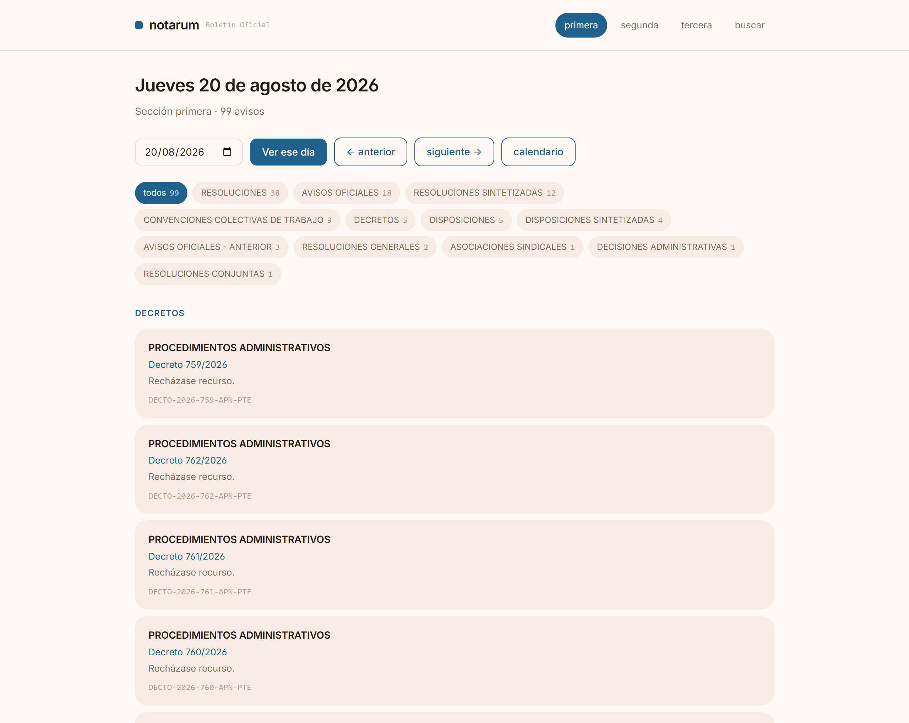
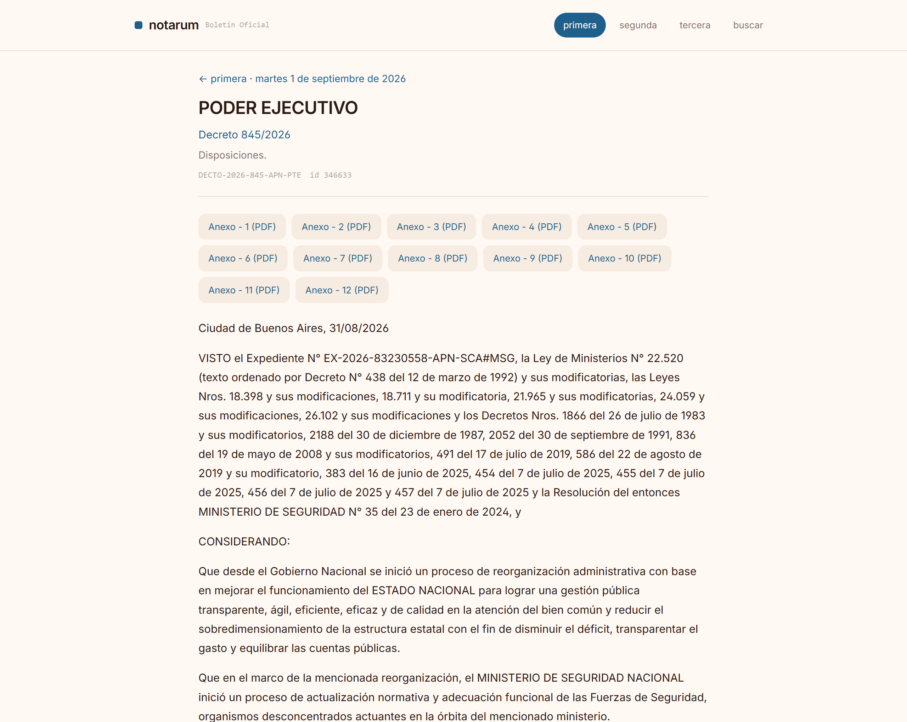
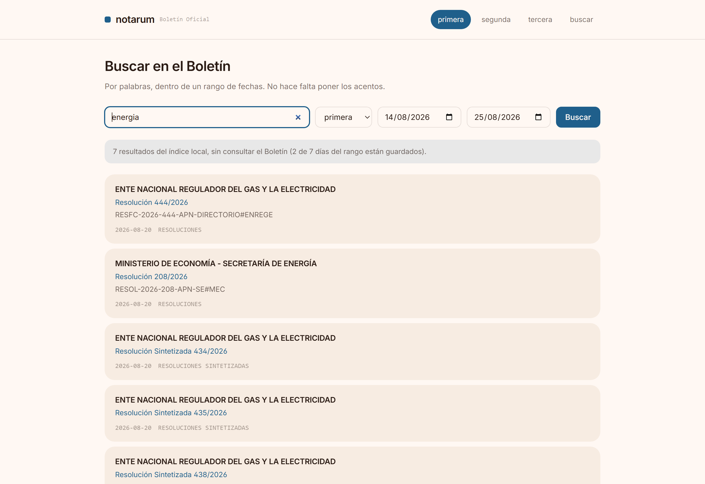
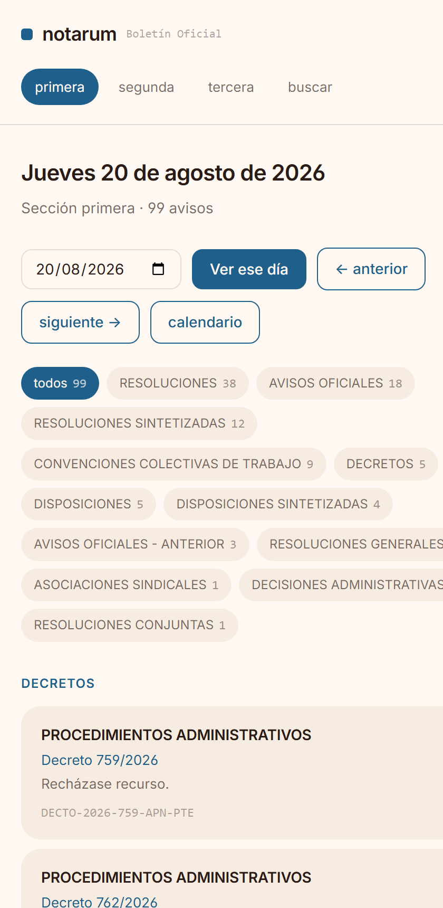

<h1 align="center">notarum</h1>

<p align="center">
  <strong>El Boletín Oficial de la República Argentina, legible.</strong><br>
  Un lector, una API y herramientas para modelos — en un solo binario.
</p>

<p align="center">
  <a href="https://github.com/diegoparras/notarum/actions/workflows/ci.yml"></a>
  <a href="LICENSE"></a>
  
  
</p>

---

El Boletín Oficial se publica todos los días hábiles y contiene todo lo que el
Estado argentino decide: decretos, resoluciones, licitaciones, sociedades,
sucesiones. Está en la web, pero está hecho para leerlo de a un aviso por vez,
con un buscador que pagina de a cien y no dice cuántos resultados hay.

**notarum lo convierte en algo que se puede leer, consultar por programa y
preguntarle a un modelo.** No opina, no clasifica, no puntúa: entrega el dato
crudo y bien tipado, y eso es todo su valor.

```bash
docker run -d -p 8080:8080 -v notarum-datos:/datos \
  -e NOTARUM_ALMACEN=sqlite ghcr.io/diegoparras/notarum:1.1.0
```

Abrí `http://localhost:8080` y ya estás leyendo el Boletín de hoy.

---

## El lector



La edición del día, con sus rubros y sus cuentas. Navegación a la fecha
anterior y la siguiente **saltando los feriados**, porque no todos los días hay
edición. Cada aviso muestra su organismo, su norma y su síntesis, y marca si
trae anexos, si salió en el suplemento o si ya se había publicado antes.

### Un aviso



El texto completo, saneado —sin los estilos ni los scripts que trae el
original— y con las tablas conservadas, que en un decreto de designaciones o de
aranceles son el contenido. Los anexos se bajan desde acá: el sitio oficial los
entrega por una llamada de JavaScript que devuelve el PDF en base64, y notarum
los sirve como archivos.

### El calendario


Qué días hubo edición, de un vistazo. La línea naranja marca los que tuvieron
suplemento. Sirve para saber dónde mirar antes de recorrer un rango de fechas.

### La búsqueda



Fijate en el detalle: **"7 resultados del índice local, sin consultar el
Boletín (2 de 7 días del rango están guardados)"**. La búsqueda dice de dónde
salieron los resultados y cuánta historia tenía para mirar. Nunca vas a creer
que viste todo cuando viste una parte.

Y encuentra `SECRETARÍA DE ENERGÍA` buscando `energia`, sin tilde, porque nadie
escribe los acentos en una caja de búsqueda.

<details>
<summary>En pantalla chica</summary>



</details>

---

## Las tres caras

### 1. El lector, en `/`

Server-rendered con `html/template`, embebido en el binario. **Cero JavaScript,
cero recursos de terceros**: el contenedor no depende de ninguna red más que la
del propio Boletín. Sigue el sistema visual del Ecosistema Escriba.

### 2. La API, en `/v1`

```bash
curl https://tu-instancia/v1/ediciones/primera/2026-09-01
```

```json
{
  "seccion": "primera",
  "fecha": "2026-09-01",
  "cantidad": 100,
  "por_rubro": { "DECRETOS": 12, "RESOLUCIONES": 80, "…": 8 },
  "avisos": [
    {
      "id": "346633",
      "rubro": "DECRETOS",
      "organismo": "PODER EJECUTIVO",
      "norma": "Decreto 845/2026",
      "referencia": "DECTO-2026-845-APN-PTE",
      "sintesis": "Disposiciones.",
      "tiene_anexos": true,
      "repetido": false,
      "url": "https://www.boletinoficial.gob.ar/detalleAviso/primera/346633/20260901"
    }
  ]
}
```

| Ruta | Devuelve |
|---|---|
| `GET /v1/secciones` | las secciones que sabe leer |
| `GET /v1/calendario/{año}/{sección}` | los días con edición y los que tuvieron suplemento |
| `GET /v1/ediciones/{sección}/{fecha}` | la edición completa; acepta `?rubro=` |
| `GET /v1/ediciones/{sección}?desde=&hasta=` | resúmenes de un rango, sin avisos |
| `GET /v1/avisos/{sección}/{id}/{fecha}` | el aviso con `texto`, `html` y `anexos` |
| `GET /v1/anexos/{sección}/{nro}/{id}/{fecha}.pdf` | el PDF del anexo |
| `GET /v1/rubros/{sección}` | el catálogo de rubros |
| `GET /v1/buscar?…&fuente=indice\|sitio\|auto` | búsqueda por texto y fecha |
| `GET /v1/salud` | estado del servicio, del sitio y de la caché |
| `GET /v1/openapi.json` | el contrato, validado por un test |

Sin clave para leer. Límite por IP. `ETag` y `Cache-Control` en todo: una
edición pasada se declara inmutable por un año, porque **una edición pasada no
cambia nunca**.

Cada error dice de quién es la culpa, para que sepas a quién mirar:

```json
{ "error": "el Boletín Oficial no devolvió lo esperado", "origen": "sitio" }
```

`origen` es `sitio`, `notarum` o `pedido`.

### 3. El MCP, en `/mcp` y por entrada estándar

Para que un modelo consulte el Boletín como una herramienta más. Seis:
`edicion`, `aviso`, `buscar`, `calendario`, `rubros` y `estado`.

```json
{
  "mcpServers": {
    "notarum": {
      "command": "notarum",
      "args": ["mcp", "--almacen", "sqlite", "--db", "/ruta/notarum.db"]
    }
  }
}
```

Están pensadas para un modelo y no para una persona, y se nota en las
decisiones: una edición se recorta a 40 avisos **y lo dice**, en vez de llenar
la ventana de contexto en silencio; un feriado se explica en palabras en vez de
devolver un error; y el aviso entrega el texto plano sin el HTML, que sólo
gasta tokens.

---

## Lo que el sitio no cuenta

El Boletín Oficial no tiene API pública ni documentación. Todo lo que hay acá
salió de leer el sitio con `curl` y mirar su JavaScript. Estas son las cosas
que costaron, por si a alguien le sirven:

- **El catálogo de rubros** está en `/busquedaAvanzada/{sección}/rubros`, que
  devuelve JSON. No está enlazado en ningún lado: lo carga por AJAX el selector
  de la búsqueda avanzada. Y los ids son textuales, no numéricos.

- **`?anexos=1` no hace nada.** Devuelve exactamente la misma página; sólo
  prende un flag de JavaScript que hace scroll. Los anexos ya están en el HTML
  del detalle, en un `onclick` que llama a `descargarPDFAnexo(...)`, y el PDF se
  baja con un POST a `/pdf/download_anexo` que responde en base64.

- **Todos los anexos de un aviso comparten el mismo `idAnexo`** y se distinguen
  por `nroAnexo`. Deduplicar por id deja uno de doce. Este lo encontró un test
  contra el sitio real, no los fixtures.

- **`?suplemento=1` tampoco hace nada:** la portada normal ya incluye el
  suplemento, y sus avisos se reconocen por el rubro `(SUPLEMENTO)`.

- **La segunda y la tercera sección sí usan `/detalleAviso/...`**, pero su id
  puede ser alfanumérico (`A1522579`) y sus avisos traen sólo el organismo.

- **El calendario viene como un string JSON adentro de otro JSON**: hay que
  decodificar dos veces.

- **La búsqueda avanzada** acepta un POST con las fechas en `dd/mm/aaaa`. Con
  `AAAAMMDD` o con ISO responde "fecha inválida".

- **El organismo puede venir vacío** y es un dato legítimo, no una falla: en el
  rubro `LEYES`, los decretos de promulgación no lo traen.

- **Un rubro terminado en `- ANTERIOR`** agrupa avisos ya publicados en una
  edición previa. notarum los entrega con `"repetido": true` para que quien
  consuma decida si los cuenta.

Todo eso está verificado contra el sitio y clavado en tests con cantidades
conocidas: 73 avisos el 15/7/2026, 52 el 10/3/2025, 100 el 1/9/2026.

---

## Montarlo

### Docker, en una línea

```bash
docker run -d --name notarum -p 8080:8080 \
  -v notarum-datos:/datos \
  -e NOTARUM_ALMACEN=sqlite \
  -e "NOTARUM_USER_AGENT=notarum/1.1 (+https://tu-dominio.com)" \
  ghcr.io/diegoparras/notarum:1.1.0
```

El volumen en `/datos` no es opcional en la práctica: sin él, cada redeploy
vuelve a bajar todo el Boletín desde cero.

### EasyPanel

**+ Service → App**, y después:

| Campo | Valor |
|---|---|
| Source → Type | `Image` |
| Image | `ghcr.io/diegoparras/notarum:1.1.0` |
| Volume | `notarum-datos` montado en `/datos` |
| Domain → Port | `8080`, con HTTPS |

Environment:

```
NOTARUM_ALMACEN=sqlite
NOTARUM_DB=/datos/notarum.db
NOTARUM_POR_MINUTO=60
NOTARUM_INTERVALO=500ms
NOTARUM_LOG=json
NOTARUM_USER_AGENT=notarum/1.1 (+https://tu-dominio.com)
```

Deploy, y entrá a la raíz. La guía completa, con las dos formas de resolver el
registry y el detalle de cada paso, está en
[docs/easypanel.md](docs/easypanel.md).

### Configuración

| Variable | Por defecto | Qué hace |
|---|---|---|
| `NOTARUM_PUERTO` | `8080` | puerto HTTP |
| `NOTARUM_ALMACEN` | `disco` | `disco`, `sqlite` o `postgres` |
| `NOTARUM_CACHE` | `/datos/cache` | directorio, con el motor `disco` |
| `NOTARUM_DB` | `/datos/notarum.db` | archivo, con el motor `sqlite` |
| `NOTARUM_POSTGRES_DSN` | — | cadena completa, con el motor `postgres` |
| `NOTARUM_POSTGRES_HOST` … | — | o las piezas sueltas: `_PUERTO`, `_BASE`, `_USUARIO`, `_CLAVE`, `_SSL`, `_ESQUEMA` |
| `NOTARUM_POR_MINUTO` | `60` | pedidos por minuto por IP; `0` lo desactiva |
| `NOTARUM_INTERVALO` | `500ms` | espera entre pedidos al Boletín |
| `NOTARUM_USER_AGENT` | `notarum/1.1 (+…)` | poné una URL de contacto real |
| `NOTARUM_LOG` | `json` | `json` o `text` |
| `NOTARUM_MCP_TOKEN` | vacío | si se define, `/mcp` exige `Bearer` |
| `NOTARUM_SIN_MCP` | vacío | apaga `/mcp` |
| `NOTARUM_SIN_WEB` | vacío | apaga el lector y deja sólo la API |

### Llenar la historia

notarum baja del sitio sólo lo que le piden. Si querés que responda rápido
sobre meses anteriores, llenalos antes:

```bash
notarum rellenar --seccion todas --desde 2026-01-01 --almacen sqlite --db /datos/notarum.db
```

Recorre el calendario, baja lo que falta al mismo ritmo de siempre, saltea lo
que ya está, y **se puede cortar y retomar**. Un año de una sección son unos dos
minutos. Con `--con-avisos` baja además el texto de cada aviso, que es lo que
permite buscar dentro del cuerpo y no sólo en el sumario.

---

## Cómo está hecho

Go sin framework. `net/http` para servir, `html/template` para las páginas,
`golang.org/x/net/html` para parsear, `bluemonday` para sanear el HTML ajeno y
`modernc.org/sqlite` —que es Go puro— para la base. **Un binario estático, sin
root, en una imagen de 38 MB.**

```
cmd/notarum        servir, rellenar y mcp
internal/boletin   lectura del sitio: cliente con ritmo, y el parseo
internal/almacen   dónde se guarda: archivos o SQLite, con su índice
internal/servicio  qué se lee de nuevo y qué ya está guardado
internal/api       rutas, errores con origen, límite por IP, contrato
internal/mcp       herramientas para un modelo, por stdio y por HTTP
internal/web       el lector, con sus plantillas y su hoja de estilo
```

**El trato con el sitio.** Un pedido cada 500 ms, reintento con espera
exponencial ante 5xx, y un `User-Agent` propio con URL de contacto. El Boletín
tiene protección F5: no se intentan sesiones ni paralelismo agresivo. Es un
sitio público del Estado y la idea es no molestarlo.

**La caché.** Una edición pasada no vence nunca; la del día en curso, a los
cinco minutos. Los feriados también se guardan: no tiene sentido volver a
preguntar por un día sin edición de hace tres años.

**El índice.** Con el motor `sqlite`, cada edición que se lee queda indexada con
FTS5 y tokenizador `unicode61 remove_diacritics 2`, que es lo que hace que
`energia` encuentre `ENERGÍA`. Buscar deja de depender del Boletín: más rápido,
sin tope de rango y sin gastarle pedidos al sitio.

---

## Pruebas

```bash
go test ./...                              # 150 tests
go test ./internal/boletin/ -tags red -v   # contra el sitio real
```

Los fixtures de `internal/boletin/testdata/` son HTML real del sitio, guardado
el 4/9/2026. Hay un test por regla de extracción, uno de contrato que valida
cada respuesta contra `openapi.json`, y una suite con la etiqueta `red` que
pega al Boletín para enterarse de que cambió de forma **antes** de que lo note
quien consume la API.

Vale la pena decirlo: los dos defectos más serios —el de los anexos duplicados
y el del organismo vacío— los encontró esa suite, no los fixtures. Un fixture
sólo sabe lo que ya viste.

---

## Licencia

MIT. Los datos son del Boletín Oficial de la República Argentina; notarum sólo
los sirve en un formato que se pueda leer.
